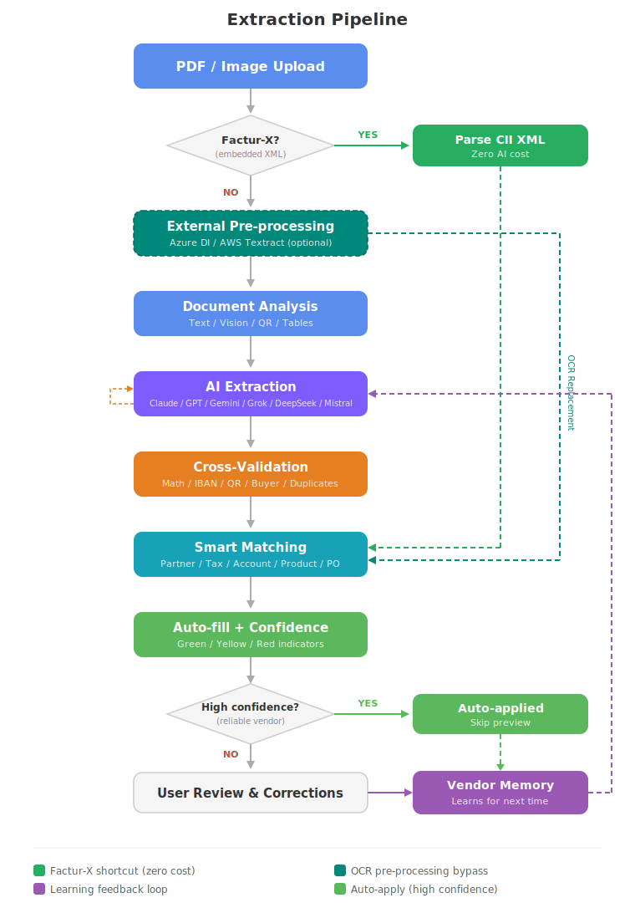
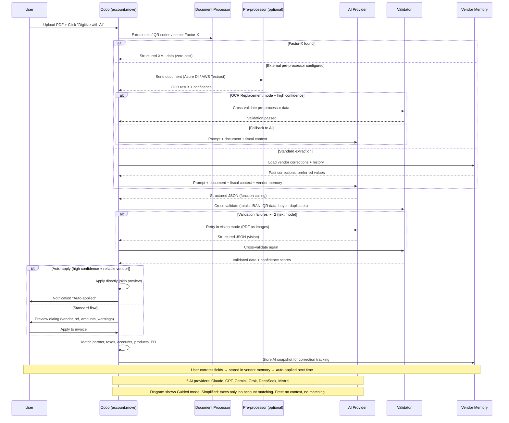

# AI Invoice Digitization for Odoo

[](https://www.odoo.com/)
[](https://www.python.org/)
[](https://www.postgresql.org/)
[](https://www.gnu.org/licenses/agpl-3.0)
[](https://www.odoo.com/)
[](#requirements)

Intelligent invoice digitization for Odoo, powered by AI. Replaces Odoo's native Enterprise-only OCR with a more accurate, truly learning extraction pipeline.

---

## Features

### Extraction

- **AI-powered extraction** -- Upload a vendor bill (PDF or image), get structured data auto-filled in seconds
- **Multi-provider architecture** -- 6 AI providers: Anthropic (Claude), OpenAI (GPT-4o), Google (Gemini), xAI (Grok), DeepSeek, Mistral AI
- **Document recognition** -- Optional Azure Document Intelligence or AWS Textract for enhanced extraction (3 configurable modes)
- **Factur-X / ZUGFeRD full parsing** -- Structured invoices are parsed from embedded CII XML at zero AI cost, with full line item extraction
- **Vision retry fallback** -- When text-based extraction produces poor results, the module automatically retries using vision mode (image)
- **Extraction preview** -- Review extracted data (vendor, reference, amounts, line items, warnings) in a dialog before applying to the invoice
- **Batch extraction** -- Select multiple invoices in list view and trigger AI extraction in batch, with progressive save
- **Language detection** -- Automatic document language detection (7 languages) injected into the AI prompt for better date and number interpretation
- **Multi-language** -- Processes invoices in any language (French, English, German, Spanish, Italian, Dutch, etc.)
- **Multi-currency** -- Detects and maps currencies automatically
- **Credit note detection** -- Automatically distinguishes invoices from credit notes
- **QR code extraction** -- Extracts payment data (IBAN, amount, reference) from Swiss QR-bill and EPC QR codes in PDF invoices (optional `pyzbar`)
- **Structured table extraction** -- Optional `pdfplumber` integration for better line item accuracy on text-based PDFs

### Extraction modes

- **Guided** (default) -- Full fiscal context (chart of accounts, taxes, vendor memory) + full matching + all validations + learning
- **Simplified** -- Taxes only in prompt, partner + tax matching, no account/product/PO matching — ideal when accountants allocate accounts manually
- **Free** -- Raw extraction: no Odoo context, no matching, arithmetic validation only — for import into external tools

### Smart matching

- **Partner matching** -- Matches vendors by VAT number, name, or email
- **Tax matching** -- Matches extracted tax rates to your Odoo tax configuration, vendor-aware
- **Payment terms matching** -- Matches extracted payment conditions (e.g. "30 jours net") to Odoo payment terms
- **Account matching** -- Assigns expense accounts to invoice lines using vendor history, category mapping, and fallback rules
- **Product matching** -- Matches vendor product codes against `product.supplierinfo` and internal references for automatic product assignment
- **Purchase order matching** -- Automatically matches invoices to purchase orders when the `purchase` module is installed (3-tier: exact, fuzzy, amount/date)

### Learning & reliability

- **Learns from corrections** -- When you correct a field, the system remembers and applies it to future invoices from the same vendor
- **Account learning** -- Line-level account corrections are remembered per vendor and description, then auto-applied on future extractions
- **Vendor reliability scoring** -- Track extraction accuracy per vendor, detect template changes
- **Vendor memory export/import** -- Transfer learning data between Odoo instances via JSON

### Safety checks

- **Document qualification** -- Detects pro-forma invoices, quotes, and "PAID" stamps before processing
- **Cross-validation** -- Mathematical verification of totals, tax calculations, and line item sums
- **IBAN validation** -- Mod-97 checksum verification on extracted bank details (catches OCR errors)
- **Buyer verification** -- Checks the invoice is addressed to the correct Odoo company
- **Duplicate detection** -- Warns before creating duplicate invoices
- **Amount anomaly detection** -- Flags invoices with unusual amounts compared to vendor history
- **Rate limiting** -- Prevents duplicate or excessive concurrent extractions

### Operations

- **Auto-apply high confidence** -- When all confidence scores are high and the vendor is reliable, extraction is applied automatically without preview
- **Rounding correction** -- Automatically compensates rounding differences between extracted totals and Odoo-computed totals (configurable strategy and tolerance)
- **Background extraction with auto-refresh** -- Optional async extraction via cron, with a client-side polling widget that auto-opens the preview when done
- **Multi-company support** -- Vendor memory, scores, and detections are scoped per company
- **Email integration** -- Auto-create and extract vendor bills from incoming emails
- **Extraction analytics** -- Graph and pivot views on extraction logs (cost, volume, tokens) and vendor scores (accuracy), accessible via the view switcher
- **Confidence indicators** -- Visual green/yellow/red indicators on each AI-filled field
- **Debug mode** -- Full logging of prompts, responses, tokens, and costs

## Compatibility

| Odoo Version | Status                    |
| ------------ | ------------------------- |
| Odoo 19      | Supported (branch `19.0`) |
| Odoo 18      | Supported (branch `18.0`) |
| Odoo 17      | Supported (branch `18.0`) |
| Odoo 16      | Supported (branch `18.0`) |

| Edition    | Status    |
| ---------- | --------- |
| Community  | Supported |
| Enterprise | Supported |

| Hosting                      | Status        | Notes                                                                      |
| ---------------------------- | ------------- | -------------------------------------------------------------------------- |
| **Odoo.sh**                  | Supported     | Full support. Custom modules and outbound API calls allowed.               |
| **On-premise** (self-hosted) | Supported     | Full support. No restrictions.                                             |
| **Third-party hosting**      | Supported     | Works on any host that supports custom Odoo modules.                       |
| **Odoo Online** (SaaS)       | Not supported | Odoo Online does not allow custom modules. SaaS support is planned for v2. |

## Requirements

- Odoo 19 (Community or Enterprise) — for Odoo 16-18, use branch `18.0`
- Python 3.10+
- An API key from one of the supported providers: [Anthropic](https://console.anthropic.com/), [OpenAI](https://platform.openai.com/), [Google AI](https://aistudio.google.com/), [xAI](https://console.x.ai/), [DeepSeek](https://platform.deepseek.com/), or [Mistral AI](https://console.mistral.ai/)
- No additional Python packages required -- the module uses only Odoo's standard dependencies

### Optional dependencies

These packages are **not required** but unlock additional features:

| Package      | Feature                                          | Install                                         |
| ------------ | ------------------------------------------------ | ----------------------------------------------- |
| `facturx`    | Factur-X / ZUGFeRD structured invoice detection  | `pip install facturx`                           |
| `pdfplumber` | Structured table extraction from text-based PDFs | `pip install pdfplumber`                        |
| `pyzbar`     | QR code extraction (Swiss QR-bill, EPC QR)       | `pip install pyzbar` + system library `libzbar` |

Install `libzbar` on your system:

```bash
# Debian/Ubuntu
sudo apt-get install libzbar0

# macOS
brew install zbar

# Odoo.sh: add libzbar0 to your apt_packages file
```

The module detects these packages at runtime and degrades gracefully when they are absent.

## Installation

1. Clone or download this module into your Odoo addons directory:

   ```bash
   cd /path/to/odoo/addons
   git clone https://github.com/PaulArgoud/account-invoice-digitize-ai.git account_invoice_digitize_ai
   ```

2. Restart the Odoo server:

   ```bash
   sudo systemctl restart odoo
   ```

3. Update the apps list:
   - Go to **Apps** > **Update Apps List**

4. Install the module:
   - Search for **"AI Invoice Digitization"** in the Apps list
   - Click **Install**

## Configuration

1. Go to **Invoicing** > **Configuration** > **Settings**
2. Scroll to the **AI Invoice Digitization** section
3. _(Optional)_ Configure **Document Recognition**:
   - **Service**: Select an external recognition service (Azure Document Intelligence or AWS Textract) or leave as "None (built-in)"
   - **Mode**: Choose how the recognition service works with the AI:
     - _Full recognition_ -- Recognition service extracts data, AI as backup only
     - _Combined_ -- Recognition service + AI cross-checks results
     - _Text extraction only_ -- Recognition service extracts text, AI analyzes it
   - **Credentials**: Enter the provider-specific credentials (Azure endpoint + key, or AWS access key + secret + region)
4. Configure **Invoice Analysis**:
   - **AI Service**: Select your AI provider:
     - _Anthropic (Claude)_ -- Default, recommended. Claude Haiku (fast), Sonnet (balanced), Opus (max accuracy)
     - _OpenAI (GPT)_ -- GPT-4o (recommended), GPT-4o Mini (affordable)
     - _Google (Gemini)_ -- Gemini 2.0 Flash (very affordable), 2.5 Flash (balanced), 2.5 Pro (best quality)
     - _xAI (Grok)_ -- Grok 3 (advanced), Grok 3 Mini (affordable), Grok 2 (balanced)
     - _DeepSeek_ -- DeepSeek Chat (fast, very affordable), DeepSeek Reasoner (chain-of-thought)
     - _Mistral AI_ -- Mistral Small 3.2 (fast, affordable), Mistral Medium 3.1 (balanced), Mistral Large 3 (best quality)
   - **API Key**: Enter your provider's API key
   - **Model**: Choose the AI model (list updates automatically based on selected provider)
   - **Extraction mode**: Choose how much accounting context the AI receives:
     - _Guided (default)_ -- Full context: chart of accounts, taxes, vendor history, automatic matching
     - _Simplified_ -- Taxes only: AI receives tax rates, accountant allocates accounts manually
     - _Free_ -- Raw extraction: no Odoo context, no automatic matching
   - **Extract invoice lines**: Extract individual line items (contextual help adapts to Accounting module presence)
   - **Automatic extraction**: Auto-extract when vendor bills arrive by email
   - **Background extraction**: Queue extractions for background processing (requires cron)
   - **QR code extraction**: Extract payment data from Swiss QR-bill and EPC QR codes (enabled by default, requires `pyzbar`)
5. _(Optional)_ Configure **Post-processing**:
   - **Auto-apply high confidence**: Skip preview when all confidence scores are high and the vendor is reliable
   - **Rounding correction**: Compensate rounding differences with configurable strategy (adjust line or add rounding line) and tolerance
   - **Confidence indicators**: Show/hide colored confidence badges on extracted fields
   - **Learning from corrections**: Enable/disable learning, with configurable threshold per vendor
6. _(Optional)_ Configure **Advanced Options**:
   - **Detailed logging**: Record full extraction details for troubleshooting
7. _(Optional)_ Click **"Test Extraction"** to validate your configuration with a sample invoice (4 test modes: full pipeline, text extraction, document recognition, prompt preview)

## Usage

### Single invoice

1. Create a new vendor bill: **Invoicing** > **Vendors** > **Bills** > **Create**
2. Upload a PDF or image of the invoice
3. Click **"Digitize with AI"**
4. A preview dialog shows the extracted data (vendor, reference, date, total, line items, warnings) -- click **"Apply to Invoice"** or **"Discard"**
5. Review the auto-filled fields -- confidence indicators show extraction reliability
6. Correct any fields as needed -- corrections are remembered for future invoices from the same vendor

**Smart cache**: If you discard and click "Digitize" again with the same attachment, the cached result is reused at no additional API cost. Use **"Re-extract"** to force a fresh API call. After background extraction completes, click **"View Results"** to open the preview from cached data.

### Batch extraction

1. Go to **Invoicing** > **Vendors** > **Bills**
2. Select multiple draft invoices in list view
3. Click **Action** > **Batch AI Extraction**
4. Review the summary (ready / skipped counts), then click **Extract All**

## How It Works



1. **Document analysis** -- The module detects the file type, extracts text (or uses vision for scanned documents), and checks for structured data (Factur-X)
2. **Document recognition** _(optional)_ -- If configured, an external recognition service (Azure Document Intelligence or AWS Textract) processes the document before or instead of the AI
3. **AI extraction** -- The document is sent to the selected AI service. The prompt content depends on the extraction mode: chart of accounts + taxes + vendor history (guided), taxes only (simplified), or raw extraction (free)
4. **Cross-validation** -- Extracted amounts are mathematically verified (totals, tax calculations, line item sums)
5. **Field mapping** -- Data is mapped to Odoo fields with confidence scores. Matching depth depends on the extraction mode (full in guided, taxes only in simplified, none in free)
6. **Learning** _(guided mode)_ -- User corrections are stored per vendor and applied to future extractions

### Extraction Pipeline (sequence diagram)



## Data Privacy

Invoice data is sent to the selected AI provider's API for processing. Review the privacy policy of your chosen provider: [Anthropic](https://www.anthropic.com/privacy), [OpenAI](https://openai.com/policies/privacy-policy), [Google](https://ai.google.dev/gemini-api/terms), [xAI](https://x.ai/legal/privacy-policy), [DeepSeek](https://www.deepseek.com/privacy), [Mistral AI](https://mistral.ai/terms/#privacy-policy).

### API key storage

The provider API key is stored in Odoo's system parameters (`ir.config_parameter`),
the standard location for module credentials. Values there are **not encrypted at
rest** — they are kept in plaintext in the database and are readable by users with
Settings administration rights. To protect the key:

- Restrict the _Settings / Technical_ access group to trusted administrators.
- Rely on database/disk encryption and backup encryption at the infrastructure level.
- Rotate the key if a database dump may have been exposed.

Use a provider key scoped to the minimum required permissions so the blast radius
stays small if it is ever disclosed.

## Author

**Paul ARGOUD**

## License

This module is licensed under the [GNU Affero General Public License v3.0 (AGPL-3)](LICENSE).
